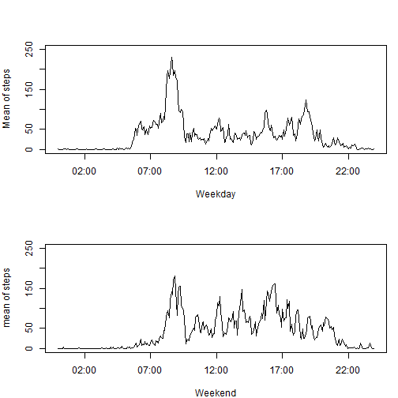

## Loading and preprocessing the data

```r
library(dplyr)
library(ggplot2)

#function to turn the interval variable to time
hoursandminutes <- function(){
        x <- seq(0,length.out = 288,by =5)
        date <-as.POSIXct("00:00", format = "%H:%M")
        x <- (x*60) + date
        x
}

activity <- read.csv("activity.csv")
activity$interval <- rep(hoursandminutes(),61)

activity$date <- as.POSIXct(activity$date,format = "%Y-%m-%d",tz = "GMT")

bydate <- group_by(activity,date)
bydate <- summarise(bydate,steps = sum(steps))
```
## What is mean total number of steps taken per day?

###Mean steps per day

```r
#mean
stepmean <- summarise(bydate, mean = mean(steps,na.rm = T))
stepmean
```

```
## Source: local data frame [1 x 1]
## 
##       mean
## 1 10766.19
```
###Median steps per day

```r
#median
stepmedian <- summarise(bydate, median = median(steps,na.rm = T))
stepmedian
```

```
## Source: local data frame [1 x 1]
## 
##   median
## 1  10765
```
###Histogram showing the steps taken per day

```r
hist(bydate$steps,breaks = 50,main = "Hstogram of steps taken per day",xlab = "Steps")
```

 

##Most steps taken during the inrerval from:

```r
byinterval[which(byinterval$mean ==max(byinterval$mean)), ]
```

```
## Source: local data frame [1 x 2]
## 
##                interval     mean
## 104 2014-11-16 08:35:00 206.1698
```
## What is the average daily activity pattern?

```r
byinterval <- activity
byinterval <- group_by(activity, interval)
byinterval <-summarise(byinterval, mean =  mean(steps,na.rm=T))

#plot the daily activity pattern
plot(x = byinterval$interval, y = byinterval$mean,type = "l",main = "Daily activity pattern", xlab = "Time of day", ylab = "Mean of steps taken")
```

 


## Imputing missing values

```r
#I haven't done yet
```

## Are there differences in activity patterns between weekdays and weekends?

```r
newactivity <- activity
newactivity$day <- "weekday"
weekend <-weekdays(newactivity$date) == "sunnuntai" | weekdays(newactivity$date) == "lauantai"
newactivity[weekend,]$day <- "weekend"
weekdays <- newactivity[newactivity$day == "weekday",]
weekends <- newactivity[newactivity$day == "weekend",]

weekdaysinterval <- group_by(weekdays,interval)
weekdaysinterval <- summarise(weekdaysinterval, mean = mean(steps,na.rm=T))

par(mfrow = c(2,1))
par(mar = c(4,4,4,1))

plot(weekdaysinterval$interval,weekdaysinterval$mean,ylim = c(0,250),type ="l",xlab = "Weekday",ylab = "Mean of steps")

weekendinterval <- group_by(weekends,interval)
weekendinterval <- summarise(weekendinterval, mean = mean(steps,na.rm=T))
plot(weekendinterval$interval,weekendinterval$mean,ylim = c(0,250),type = "l",xlab = "Weekend",ylab = "mean of steps")
```

 
